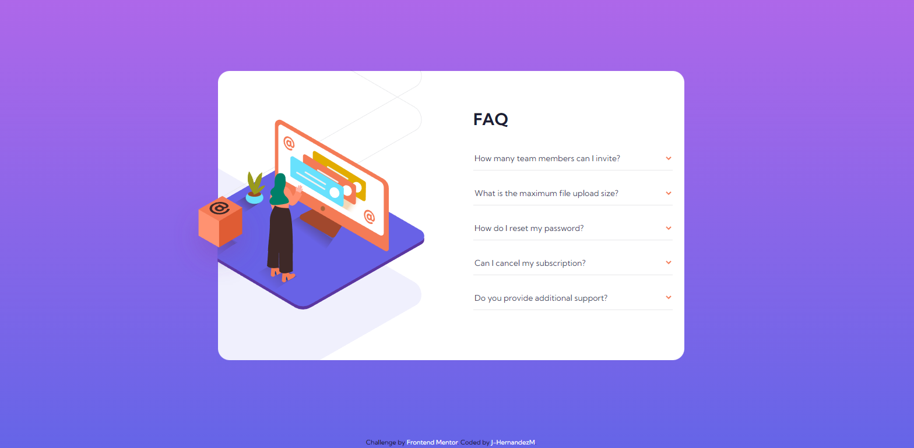

# Frontend Mentor - FAQ accordion card solution

Esta es mi propuesta de solucion al reto [FAQ accordion card challenge on Frontend Mentor](https://www.frontendmentor.io/challenges/faq-accordion-card-XlyjD0Oam).

## Tabla de contenidos

- [Descripcion](#descripcion)
  - [El desafio](#el-desafio)
  - [Screenshot](#screenshot)
  - [Links](#links)
- [Mi proceso](#mi-proceso)
  - [Hecho con](#hecho-con)
  - [Lo aprendido](#lo-que-aprendi)
  - [Aprendiendo](#aprendiendo)
- [Autor](#autor)

## Descripcion

Esta es mi propuesta de solucion al desafio de crear un componente de preguntas frecuentes interactivo usando HTML, CSS y JavaScript. 

En este caso aplique la metodologia Mobile First y de ahi escale a desktop. 

En el JavaScript emplee el uso de clases para crear/simular una "base de datos" y crear dinamicamente los elementos HTML para las preguntas.

Ademas se agregaron sus repsectivos listeners y sus cambios mediante clases a los estilos CSS a partir de JavaScript.

En cuanto a CSS usamos propiedades de posicionamiento, z-index y clip-path para acomodar las imagenes en su version desktop.

## El desafio

El usuario deberia poder:

- Ver el layout optimo dependiendo de su tamano de pantalla.
- Ver la interaccion cuando se coloca el mouse encima de los elementos.
- Seleccionar el boton de submit y una calificacion cualquiera
- Ver el menu "Thank you" despues de enviar su calificacion

## Screenshot

## Links

- Solucion: [GITHUB](https://github.com/J-HernandezM/faq-accordion-card)
- Live site: [PAGES](https://j-hernandezm.github.io/faq-accordion-card/)

## Mi proceso
En este caso aborde el proyecto centrandome mucho mas en el uso de CSS GRID y afrontando los retos que ello conlleva ya que estaba acostumbrado a usar mas Flexbox. Logre solucionar los problemas de posicionamiento que iban surgiendo usando margenes.

En el JavaScript me costo un poco pero logre entender la logica que necesitaba aplicar para agregar los listeners y ocultar las demas respuestas y aplicar los estilos.

En cuanto al posicionamiento de las imagenes lo realice usando position absolute, clip-path y z-index, fue prueba y error basicamente.

## Hecho con

- Semantic HTML5 markup
- CSS custom properties
- Flexbox
- CSS Grid
- Mobile-first workflow
- simple JavaScript

## Lo que aprendi

Recorde como tratar eventos de los listeners en JavaScript, tambien manejar clases y estilos desde JS, recorde como se hacia una clase y se creaban elementos en ella y tambien crear dinamicamente los elementos en HTML.

Tambien aprendi como cortar una imagen como si fuese una mascara de recorte, y crear gradientes.

## Aprendiendo

Me gustaria en los siguientes proyectos seguir aplicando JavaScript asi sea basico para no olvidar las cositas que he aprendido.

## Autor

- Website - [Portfolio en construccion](https://j-hernandezm.github.io)
- Frontend Mentor - [@J-HernandezM](https://www.frontendmentor.io/profile/J-HernandezM)
- Github - [@J-HernandezM](https://github.com/J-HernandezM)
- Twitter - [@__HernandezM](https://www.twitter.com/__HernandezM)